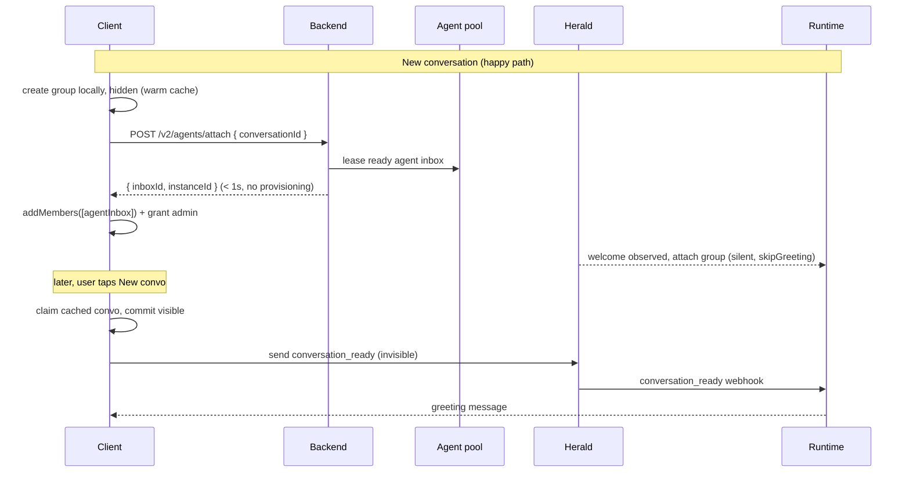

# Agent-native conversations

**Authors:** Jarod, Claude · **Date:** Aug 3, 2026 · **Status:** Draft for team review
**Repos:** convos-ios · convos-backend · convos-assistants · herald-lite · convos-cli · ConvosInvites

Every conversation ships with an always-online agent that admits new members, so
joins never wait on a phone. Groups stay human-owned, the server pools ready
agents instead of conversations, and one invisible message cues the agent when
its group comes alive.

## Summary

- **An agent in every conversation, from message zero.** The user shapes it by
  chatting; there is no "Make an agent" authoring step.
- **Agent-admitted invites.** One invite per conversation, admitted by the
  always-online agent, with a signed per-share wrapper so "A joined via B"
  stays true and forgery-proof, and the sharer's device as the offline-tolerant
  fallback admitter.
- **A server-side pool of ready agents, not conversations.** The client keeps
  its warm conversation cache (instant "New convo"); the backend keeps
  pre-registered, pre-warmed agent inboxes and attaches one in under a second.
- **A `conversation_ready` cue.** The agent joins hidden conversations silently
  and greets the moment the user actually enters.
- **Short invite links.** A privacy-preserving backend shortener replaces
  today's payload-length URLs (which read as spam) with `convos.org/i/<code>`
  links and lightweight QRs, without the server ever seeing invite contents.

**Non-goals:** agent-owned groups (rejected: puts MLS welcome delivery on the
"New convo" tap, inverts the root of trust to operator keys, kills offline
creation); removing member-device admission (it remains the degraded path so
agent-less groups stay first-class); changing the E2EE transport.

## Architecture at a glance

Two principles carry the design:

1. **User owns; agent administers.** The client creates the MLS group locally
   (instant, offline-capable, human root of trust) and grants the attached
   agent admin so it can admit joiners forever after.
2. **Pool the slow thing.** Group creation was never slow; agent provisioning
   was (register identity -> boot runtime -> join). The server pre-does
   provisioning and hands out finished agents.



## Design: invites — one invite, two signatures, two admitters

Today an invite names exactly one inboxId (the inviter) and admission waits for
that device to come online — the recurring stuck-at-"Verifying" class. The new
invite is a two-layer payload:

```
core (minted once, at conversation creation, by the owner's device):
  { conversationRef, admissionKey, agentInboxId, creatorSig }

wrapper (minted locally, per share, by whoever taps Share):
  { coreHash, sharerInboxId, sharedAt, sharerSig }
```

- **The core names the primary admitter** — the conversation's agent, always
  online.
- **The wrapper names the fallback** — the sharer, who is socially the right
  person to admit you anyway. Wrapper signing is local and instant; the online
  requirement only ever applied to admission, which the agent now covers.
- **Provenance is cryptographic, not asserted.** "A joined via B" renders from
  a signature, not a spoofable metadata field (the `askerInboxId` lesson).
  Each share link is individually attributable and revocable instead of one
  group-wide secret.

### Join flow

1. Joiner resolves the link, verifies both signatures locally, and sends the
   `JoinRequest` (existing content type, extended to carry the wrapper) to the
   **agent's inbox**.
2. Herald — which hosts the agent's inbox and already processes agent-side
   joins — validates: wrapper signature is by `sharerInboxId`, and that sharer
   is a *current member* (same on-network membership check the Agent DMs plan
   uses for its acceptance policy).
3. Herald performs `addMembers`, stamps provenance (`joinedVia: sharerInboxId`)
   into the conversation's custom metadata so every client can render
   "A joined via B", and publishes `invite_join_handled`.
4. **Fallback:** if no admission lands within a client-side timeout (~10s), the
   joiner sends the same `JoinRequest` to the **sharer's inbox** — today's
   flow, verbatim. `invite_join_handled` already exists to stop
   double-processing across an inviter's paired devices; its semantics extend
   unchanged to "any admitter, first commit wins."

### Properties worth naming

- **Removing a member invalidates every link they shared** (membership is
  checked at admission time) — a revocation property today's invites lack.
- **Removing the agent degrades, never bricks:** wrapper-only links keep
  working via the sharer path, which is literally the current system.
- **Abuse surface:** the agent is an always-online admitter, so herald needs
  per-conversation admission rate limits and the core needs a rotation story
  (rotate `admissionKey` -> all outstanding links die at once).

## Design: short links the server can't read

Invite URLs are long because the entire self-contained signed payload rides in
the URL. That self-containment is a feature — no resolver, nothing server-side
to leak — but the resulting links get flagged as spam, look untrustworthy in a
text message, and produce dense, slow-scanning QR codes. The two-layer invite
makes this worse, not better.

The fix is a shortener that keeps the payload opaque to the server:

```
share time (client):
  key        = random 128-bit
  ciphertext = encrypt(core + wrapper, key)
  code       = POST /v2/invites/links { ciphertext }      # authed, rate-limited
  short URL  = https://convos.org/i/<code>#<key>          # key in the fragment

join time:
  new client   universal link -> GET /v2/invites/links/<code> -> decrypt with fragment key
  browser      resolver page fetches ciphertext, decrypts in JS (fragment never
               leaves the browser), shows "Open in Convos" -> legacy deep link
```

- **The fragment is the trick.** Browsers never transmit the URL fragment, so
  the backend stores and serves only ciphertext. It learns that a link was
  resolved — not what conversation it opens or who shared it. This is
  *strictly better* than today, where the full payload travels to the web
  server as a query parameter whenever a link opens in a browser.
- **One short link per share.** Each share action mints its own code, so the
  wrapper design gets a management handle for free: revoking "the link you
  sent Dana" is `DELETE /v2/invites/links/<code>` — instant, before any
  cryptographic rotation is needed.
- **Codes are high-entropy (>= 64 bits, ~11 base62 chars), unauthenticated to
  resolve** (the joiner has no account yet) but aggressively rate-limited,
  with resolution telemetry for abuse detection.
- **Stay on `convos.org`.** A recognizable brand apex beats a generic short
  domain for both human trust and spam-filter reputation, and the
  universal-link entitlements already exist for the domain family.
- **Offline share fallback:** if the shorten call fails, share the long
  self-contained URL — nothing about the long format goes away.

### Legacy clients, all four directions

- **Old links never break.** The long format keeps resolving forever; the
  shortener is additive.
- **Old client receives a short link:** its universal-link pattern doesn't
  match `/i/`, so the link opens in the browser — where the resolver page
  decrypts in JS and offers "Open in Convos" via the legacy deep-link format
  (carried in a fragment or custom scheme, so the expanded payload still never
  transits a server). One extra tap; zero broken joins.
- **Old client shares:** it mints long URLs as today. New clients can shorten
  *any* payload — including legacy single-inboxId invites — so shortening
  ships before the two-layer format and delivers the spam fix immediately.
- **QR codes:** new clients render QRs of the short URL (dramatically lighter
  modules, faster scans); scanning today's dense QRs continues to work.

## Design: agent pool — pre-provisioned agents, leased in one call

The slow pipeline today — `agents/join` -> herald registration -> container
boot -> poll for inboxId -> `addMembers` — moves off the request path entirely.
The assistant worker maintains a pool of **finished** agents: identity
registered with herald, key packages published, container image warm, no
conversation attached.

```
POST /v2/agents/attach
  body:    { conversationId, variantId? }
  returns: { inboxId, instanceId }        # immediately — the lease is a DB row flip
```

- The backend leases a ready agent from the pool and returns its inboxId. No
  provisioning, no polling; target p95 < 1s.
- The client does `addMembers([inboxId])` and grants the agent **admin** (so
  it can admit joiners). Herald's welcome observer sees the add and attaches
  the group to the leased instance — the same `conversation_added` mechanism
  the Agent DMs plan introduces.
- A pool-replenish workflow (cron) keeps N ready agents per environment,
  reusing the existing create-assistant workflow minus the join step. Pool
  sizing starts small (N~20 dev / N~100 prod) and scales on lease-rate
  telemetry.
- `variantId` keeps working for dev: variant joins can bypass the pool and
  provision on demand (dev-only; latency acceptable there).
- The existing `POST /v2/agents/join` stays for template-instantiated agents
  (gallery/suggested agents); attach is only the default-agent path.

**What this deletes from the client:** the retrofit's join/poll/retry layer
(join bursts that hit rate limits, `MissingSequenceId` races between
registration and `addMembers`, the 30s failure cooldown) collapses to: call
attach, add the member, grant admin — with one idempotent retry at claim time.
The device-side conversation cache **stays exactly as is**: it's what makes
"New convo" instant, and nothing server-side needs to replace it.

## Design: `conversation_ready`, end to end

Agents join cached conversations long before a human enters, so the greeting
needs a cue, not a timer. The client half is already built (convos-ios #1268):
a `convos.org/conversation_ready:1.0` content type, sent once when a claimed
conversation is committed visible, invisible on every client surface
(ingest-ignored, push-dropped, never rendered).

The server half is a four-edit chain — herald currently drops all
non-`xmtp.org` content types before anything downstream sees them:

1. `@xmtp/convos-cli`: register a `ConversationReadyCodec` and add the type
   guard (`isConversationReadyMessage`).
2. `herald-lite` router: branch before the displayable-message filter, mapping
   the message to a webhook event.
3. `herald-lite` webhooks: add the `conversation_ready` event variant to the
   payload union.
4. Hermes runtime: handle the event — send the greeting if unsent, else no-op.
   Idempotent by design; duplicate cues are harmless.

The assistant worker needs no change — it forwards herald webhook bodies
verbatim. Join options stay `skipGreeting: true` so the runtime holds its
welcome until the cue arrives.

## Design: runtime — the agent builds itself, in the open

A bare join (no template) puts the agent in *self-build* mode: greet by asking
what the group is up to, hold a short discovery conversation until a brief
genuinely holds together, then build and activate *itself* — never narrating
"I'm building your custom agent in the background."

- Graduate the self-build arc from the agent-first prototype
  (convos-assistants #2855): `is_synthesized_default_template` routes greeting
  and kickoff, so the legacy builder flow keeps its voice and bare joins get
  the new one.
- Greeting content: the self-build greeting ("Hey $NAME! What are we up to
  here?"), fired on `conversation_ready` rather than at attach.
- Until the cue chain ships, interim behavior is acceptable: silent join,
  agent speaks on the user's first message.

## Design: client (convos-ios)

PR #1268 already shipped: builder-UI removal, the "New convo / Invite friends
later" picker, cache-time provisioning hooks, the ready-signal send, and the
coordinator that dedupes concurrent ensures. On top of that:

- Swap `addAgentToConversation`'s provision-and-poll for the attach endpoint;
  keep the claim-time ensure as a one-shot idempotent retry.
- Grant the agent admin after `addMembers` (conversation metadata writer role
  update) — prerequisite for agent-admitted joins.
- Invite plumbing: mint the two-layer payload in ConvosInvites (core at
  creation alongside today's invite tag; wrapper at share time), extend
  `JoinRequest` to carry the wrapper, add the joiner-side fallback timer,
  render provenance from the stamped metadata.
- Version the invite slug so old links keep resolving.

## Rollout: six milestones, each independently shippable

### M1 — Greeting cue (unblocks the current retrofit)
**Repos:** convos-cli, herald-lite, hermes runtime.
Ship the four-edit `conversation_ready` chain. The client already sends the
cue, so this immediately upgrades the shipped retrofit from "agent speaks
after your first message" to "agent greets on entry." Small, isolated,
testable on the local stack.

### M2 — Agent pool + attach endpoint
**Repos:** convos-assistants worker (pool workflow, lease table),
convos-backend (`/v2/agents/attach`), convos-ios (swap the join call, add
admin grant).
Kills provisioning latency and the client's failure-handling layer. Success
metric: attach p95 < 1s; zero `MissingSequenceId` in client telemetry. The old
join path remains for templates and as a pool-empty fallback.

### M3 — Short invite links (independent — can ship first)
**Repos:** convos-backend (link store + resolve/revoke endpoints), web
resolver page, convos-ios (client-side encrypt + shorten on share, short-QR
rendering, universal-link route).
No dependency on M1/M2 — it shortens today's legacy payloads on day one, the
immediate fix for invites reading as spam. When M5's two-layer format lands,
the same pipe carries it unchanged. Success metric: share-sheet links under
~50 characters; QR module count visibly reduced; zero increase in failed
joins.

### M4 — Agent-admitted joins
**Repos:** herald-lite (JoinRequest handling on agent inboxes: wrapper
verification, membership check, addMembers, provenance stamp, rate limits),
convos-ios (send JoinRequest to the agent first).
Requires M2's admin grant. Old invites still work unchanged — this only adds
a faster admitter. Success metric: median join-to-member time drops from
"whenever the inviter's phone wakes" to seconds.

### M5 — Two-layer invites + provenance
**Repos:** ConvosInvites (core + wrapper formats, versioned slug), convos-ios
(share-time wrapper mint, fallback timer, "A joined via B" UI), herald-lite
(wrapper validation mandatory for new-format links).
New-format links carry both admitters and signed provenance, and each share
rides its own short link from M3 — per-share revocation with a one-tap UX.
Old-format links keep resolving through the legacy path as long as old clients
exist.

### M6 — Consolidation
**Repos:** all.
Retire the interim machinery the milestones obsolete: the client's
provision-retry cooldowns (M2), silent-until-first-message greeting (M1), and
— once old clients age out — the single-inboxId invite format. Decide the fate
of the in-conversation "invite an agent" surfaces for pre-existing agent-less
groups.

## Compatibility and migration

| Case | Behavior |
|---|---|
| Old client, new invite | Versioned slug: the resolver serves old clients a legacy view naming the sharer as the (only) admitter — degraded to today's flow, never broken. |
| Old client, short link | Universal-link pattern miss opens the browser resolver, which decrypts in JS and hands off via the legacy deep-link format — one extra tap, never a broken join. |
| Revoked short link | Resolution 404s with a friendly "this invite was turned off" page; the underlying long-format invite (if separately held) is unaffected until cryptographic rotation. |
| New client, old invite | Single-inboxId invites keep working via the existing path; no agent admission, no provenance. |
| Pre-existing conversations | No default agent, no backfill. The in-chat "invite an agent" surface remains their path to one; adding an agent + admin grant upgrades their invites to agent-admitted. |
| Group removes its agent | Core-path admission dies; wrapper-path (sharer) admission continues. New shares still mint valid wrappers. Nothing bricks. |
| Agent runtime outage | Joins degrade to the fallback timer + sharer admission — today's behavior, globally. |
| Pool empty | Attach falls back to provision-on-demand (old latency, same contract); replenish cron catches up. |

## Work breakdown by repo

| Repo | Work | Size |
|---|---|---|
| convos-cli | `ConversationReadyCodec` + type guard; wrapper verify helpers for herald (M1, M4) | S |
| herald-lite | Ready-cue router branch + webhook event (M1); agent-inbox JoinRequest admission: wrapper sig + membership check, addMembers, provenance stamp, `invite_join_handled`, rate limits (M4, M5) | M–L |
| convos-assistants | Runtime `conversation_ready` handler (M1); self-build arc graduation from #2855 (M1); pool workflow + lease state in D1 (M2) | M |
| convos-backend | `POST /v2/agents/attach` with pool lease + on-demand fallback; pool telemetry (M2); invite link store + resolve/revoke endpoints, rate limits (M3) | M |
| web (convos.org) | Resolver page: fetch ciphertext, decrypt with fragment key in JS, "Open in Convos" legacy handoff (M3) | S |
| ConvosInvites | Two-layer payload: core + wrapper formats, signing, versioned slug encoding (M5) | M |
| convos-ios | Attach-endpoint swap + admin grant (M2); encrypt-and-shorten on share, short QR, link route (M3); agent-first JoinRequest + fallback timer (M4); wrapper mint at share, provenance UI (M5) | M–L |

## Open questions (settle during M1–M2)

- **Admin vs. super-admin for the agent, and the MLS policy set.** The agent
  needs exactly: add members, write the provenance metadata field. Verify the
  group permission policy grants those to admins (not only super admins), and
  that a human super admin can always remove the agent.
- **Payload budget.** Core + wrapper must still fit a scannable QR and a short
  link. If tight, the wrapper can live server-side behind the slug (resolver
  returns it) at the cost of the resolver learning share-graph metadata — a
  privacy trade to decide explicitly.
- **Membership check source of truth.** On-network check (strong, slower) vs.
  herald's view of the attached group (fast, eventually consistent). The Agent
  DMs plan chose on-network for its acceptance policy; admission should
  probably match.
- **Pool economics.** Idle warm agents cost container time. Measure lease rate
  before committing to pool size; consider warm-identity/cold-container as the
  resting state (registration is the latency that matters; container boot can
  overlap the user's first seconds in the convo).
- **Provenance display policy.** We can render "A joined via B" — decide
  whether we always do, and who sees it (members only, admins only).
- **Short-link lifetime.** Default TTL vs. live-until-revoked. A default TTL
  (say 30 days, sharer-extendable) bounds the enumeration surface and matches
  real usage — but changes expectations. Decide before M3 ships.
- **Resolve-endpoint hardening.** The resolver is necessarily unauthenticated;
  settle the rate-limit shape (per-IP + per-code), whether App Check gates
  in-app resolution, and what the browser path uses instead.

---

*Context this proposal assumes: convos-ios #1268 (agent-in-every-convo client
retrofit, draft), convos-assistants #2855 (self-building bare agents — the
agent-first prototype runtime), the CON-761 Agent DMs plan (welcome observer,
membership checks, direct-add), and the current single-inboxId invite system
in ConvosInvites.*
