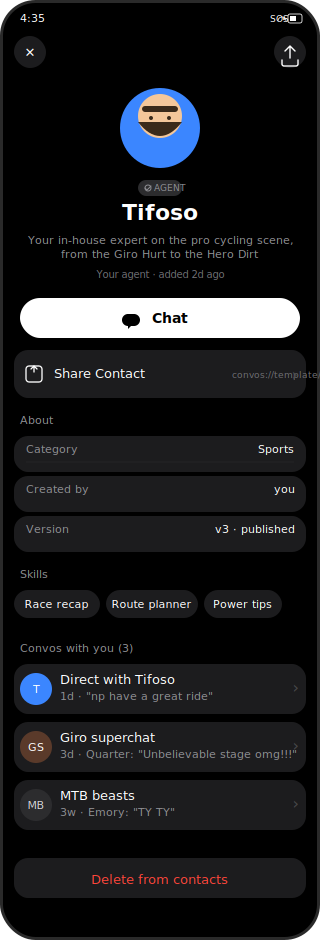
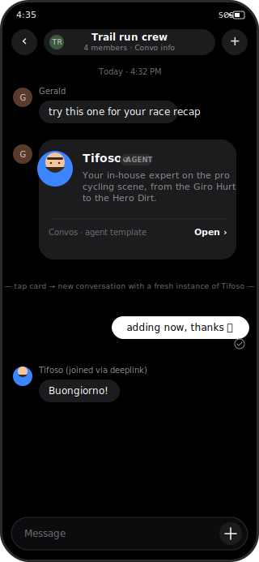
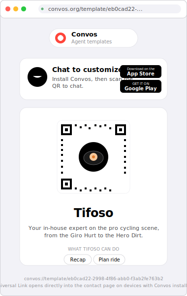
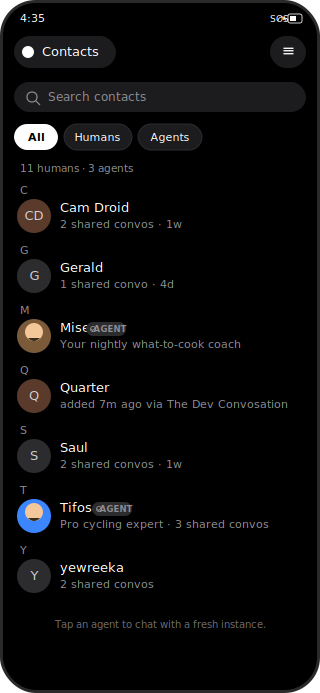
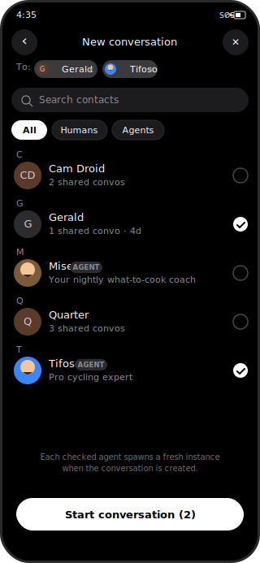

# 1-Pager: Agent Templates

> **Status**: Draft (two-phase delivery)
> **Author**: Cameron Voell
> **Created**: 2026-05-18
> **Updated**: 2026-05-19
> **Companion PRD**: TODO — `docs/plans/agent-templates-prd.md` (to be drafted)
> **Backend**: PR #199 (`feat/agent-templates-crud`) landed the template CRUD on `otr-dev`; both instantiation endpoints (new-conversation and existing-conversation) are in progress
> **Related**: [contact-list.md](./contact-list.md), [contact-list-prd.md](./contact-list-prd.md), [agent-join-endpoint.md](./agent-join-endpoint.md)

## 1. Tweet Headline

👉 "Convos lets you share an AI agent like you'd share a contact card. Drop the link in a chat, your friends tap once, they get their own private copy."

## 2. Show, Don't Tell

Wireframes for the five MVP surfaces, organized by delivery phase. Built as standalone SVGs so they live in-repo and render in any markdown viewer.

**Phase 1** — agent contact view (in-chat entry only), share, deeplink card, tap-to-new-conversation:

| | |
|:---:|:---:|
|  **1. Agent template contact page** — hero surface. In **Phase 1, this is accessible only from inside a chat** (tap the agent's avatar in a message bubble, the member list, the read-receipts row). The chat plus-menu's "Contact info" path on a verified-agent member resolves here. Avatar, name, description, creator attribution, agent badge, **Chat** (primary CTA — Phase-1 default spawns a fresh instance in a new convo; the existing-1:1 short-circuit is a fast-follow inside Phase 1), **Share** (offers the iOS share sheet with the template's `publishedUrl` web link), About section, Skills chips, **Convos with you** list, destructive footer. No Edit, no Duplicate. |  **2. Shared link rendered as a chat card** — when a template's `publishedUrl` lands in a Convos message bubble, the iOS client renders it inline as a clean preview card (image, name, description) built from the page's OpenGraph tags, instead of a raw link. Generic link-unfurl — no template-specific URL parsing. Tapping it opens the link like any other link. |
|  **3. Web page at the `publishedUrl`** — the page every shared link opens. V1 has no Universal Link interception, so the browser always loads this page first, for app-having and non-app visitors alike. Modeled on today's `agents-dev.convos.org` "Mise" surface. Convos header, agent name + description + skill chips, an "Open in Convos" button (custom URL scheme) for visitors who have the app, and "Install Convos" App Store / Google Play badges + a QR for those who don't. Hosted by the convos.org web frontend; already implemented. | |

**Phase 2** — agents in contacts, picker integration, and the new "add instance to existing conversation" endpoint:

| | |
|:---:|:---:|
|  **4. Contacts list with humans + agents** — extends the contacts-PRD browse screen. Adds the **All / Humans / Agents** filter chip row, mixes agent rows inline with human rows alphabetically, and tags each agent row with an **AGENT** badge. Today's `!$0.isVerifiedAgent` filter goes away. Tapping an agent row opens surface 1 in its standalone mode (Phase 2 widens the entry-point set from "only-from-chat" to "from-anywhere"). |  **5. Contacts picker with agents** — multi-select picker. Agents are selectable alongside humans in both `.newConversation` and `.addToConversation(conversationId:)` modes; checked agents spawn fresh instances when the conversation is created OR when they're added to an existing conversation via the chat plus-menu's "Add from Contacts" entry (the latter depends on the new backend endpoint in §3's API callout). |

These are wireframes, not final visuals — they fix the surfaces and copy but leave room for a real designer pass before ship. Three design notes worth calling out from the sketching pass:

- **The contact page is one component, two modes — and Phase 1 only ships the scoped one.** Same shape as the contacts-PRD's `ContactCardMode.standalone` / `.scopedToConversation` split. Phase 1 only ships `.scopedToConversation` (entry from a member tap inside a chat). Phase 2 ships `.standalone` (entry from the contacts list, surface 4) by adding the mode parameter — no new view. The scoped mode appends group-actions ("Remove from this convo") below the standard sections.
- **The deeplink card (surface 2) is the discovery primitive.** Phase 1 has no contacts surface; agents propagate from user to user through the share link rendered as a chat card. The card is the entire onboarding for a template across users until Phase 2's contacts integration adds passive auto-add.
- **The contacts list, the picker, and today's contacts-PRD picker are one component in three modes** (Phase 2 only). Adding agents to the picker is a row-type extension, not a new screen. The filter chip row is shared between surface 4 and surface 5 so the user's mental model is consistent across browse-and-pick.

Open visual questions still on the table: default state of the filter chip (All / Humans / last-used), placement of the AGENT badge (inline as drawn vs. section divider between humans and agents), whether the picker should hide already-in-convo agents the same way `ContactsPickerMode.addToConversation` hides already-in-chat humans, and whether the deeplink-card-in-chat (surface 2) supports the existing-1:1 short-circuit on tap or always opens a new conversation.

- 🍿 Loom demo link — N/A
- 🎨 Figma file link — N/A (designer to produce alongside the contacts-list filter chip work)

## 3. How It Works

> ⚠️ **Backend API dependency — loud callout.** Both phases below depend on backend endpoints that are **not yet shipped**. This 1-pager is being written ahead of the API contracts so iOS work can stack against the agreed shape rather than wait.
>
> - **Phase 1 — instantiate-into-a-new-conversation.** Needed by Phase 1's Chat button (item P1.2) and the deeplink-tap flow (the web page's "Open in Convos" button → custom scheme → app). Takes a `templateId` plus a fresh conversation invite slug and joins a configured instance into it. Likely shape: extend `POST /v2/agents/join` to accept an optional `templateId`, or add a sibling `POST /v2/agent-templates/:id/instances`. **In progress; backend lead is locking the contract.**
> - **Phase 2 — instantiate-into-an-existing-conversation.** Needed by Phase 2's picker integration in `.addToConversation` mode (item P2.3). Takes a `templateId` plus an existing `conversationId` and joins a fresh instance into the existing conversation. This is the new one — `agents/join` today is conversation-scoped only via an invite slug, not by id. **This endpoint does not exist yet and is the single largest external dependency for Phase 2.** Not blocking Phase 1.
>
> The iOS work in both cases stubs against the agreed contract behind a feature flag until the backend lands; nothing about Phase 1's surfaces is conditional on the Phase 2 endpoint existing.

### Phase 1 — agent contact view, share, deeplink-into-new-conversation

The minimum viable shipping unit: a user already in a conversation with an agent can tap its avatar, see the agent's contact view, share a deeplink, and friends who tap the deeplink (inside or outside Convos) land in a new conversation with their own instance of the same agent. **Phase 1 explicitly does NOT touch the contacts list, the contacts picker, the chat plus-menu's "Add from Contacts" entry, or any "add an instance to an existing conversation" flow.** Discovery happens entirely through the deeplink-rendered-as-a-card mechanism.

1. **P1.1 — Agent contact view, accessible only from inside a chat.** Tapping a verified agent's avatar anywhere it's rendered inside a chat (a message author avatar, the member list, the read-receipts row, the conversation-header avatar on a 1:1) opens the **Agent Template Contact Page** described in surface 1 of §2. Reuses the contacts-PRD's `ContactCardMode.scopedToConversation(conversationId, …)` path that already exists for human members — the only iOS change here is recognising "this member is a template-backed verified agent, render the agent variant of the card." The `.standalone` mode (entry from the contacts list) is **Phase 2.**
2. **P1.2 — Chat button — default spawn-and-join.** Tapping **Chat** on the contact view calls the Phase-1 instantiation endpoint (see callout above) with the template id and a freshly-created conversation invite slug. The backend claims an agent-pool instance, configures it with the template's prompt / name / avatar / tools / connections, and routes it into the new conversation. We treat `.ready` as a strong guarantee that the conversation exists AND the agent has joined, mirroring Phase 2.10 of the contacts PRD. The existing-1:1 short-circuit ("if you already have a 1:1 with this agent, navigate there instead") is a **Phase-1 fast-follow** — wired *after* the default spawn-and-join flow is solid; Phase 1 ships without it so the happy path lands first.
3. **P1.3 — Share button — copies the shareable web link.** Tapping **Share** on the contact view opens the iOS share sheet with the template's `publishedUrl` — the canonical web link the backend's `serializeAgentTemplate` returns for any non-draft template (e.g. `https://agents-dev.convos.org/<slug>.<hash>` in dev). iOS shares whatever `publishedUrl` the API hands back; it does **not** construct the URL itself, so the host and path shape stay owned by the backend across environments. What gets shared is a plain web URL — a recipient who taps it always opens the web page first (surface 3); the page bridges into the app via its "Open in Convos" button (custom URL scheme). Universal Link interception — tapping the web URL routing straight into the app, skipping the browser — is intentionally deferred for V1 and can be added later without changing the shared URL (see P1.5).
4. **P1.4 — Shared link rendered in a chat as a card.** When a template `publishedUrl` appears in a Convos message body, the iOS client renders it inline as a preview card instead of a raw link. The card is built from the page's **OpenGraph metadata** — the `publishedUrl` page already server-renders `og:title`, `og:description`, and a generated `og:image`, so a non-JS fetch sees them. This is a *generic* link-unfurl: host-agnostic, no agent-template-specific URL parsing, reusing whatever link-preview mechanism Convos has (or builds) for all links. Fidelity is OG-level — title, description, image — not the structured fields (skills, category) a template-specific fetch would give. Degrades gracefully: a deleted / draft / archived template, or a missing unfurler, falls back to a plain tappable link. Privacy note: any unfurl means the recipient's device fetches a URL that arrived in an end-to-end-encrypted message — see the UAQ on unfurl mechanism + privacy.
5. **P1.5 — Universal Links — deferred for V1.** V1 does not register Universal Links. The shared `publishedUrl` is a plain web URL: tapping it always opens the browser to the web page (surface 3), and the page bridges into the app via the custom URL scheme (`convos[-{env}]://template/<id>`) behind its "Open in Convos" button. Universal Link interception — the web URL routing straight into the app and skipping the browser — is a clean later addition: it needs the `applinks:` entitlement plus an AASA file on the share host, and it does not change the shared URL, so it can land without reissuing any links. Tracked as a follow-up. The web-preview page itself (surface 3) is hosted by the convos.org web frontend (not `convos-backend`) and consumes the backend's public detail endpoint `GET /api/v2/agent-templates/:idOrHashedSlug`. See FAQ #3.

### Phase 2 — agents in contacts, picker integration, and add-to-existing-conversation

Phase 2 takes the Phase-1 building blocks and integrates them into the contacts surface established by the contacts PRD. Each behaviour either reuses the Phase-1 deeplink mechanism or depends on the Phase 2 backend endpoint flagged in the callout above.

1. **P2.1 — Templates appear in the main contacts list.** The existing `ContactsView` browse screen extends to render agent rows inline with human rows, alphabetical, with an **AGENT** badge on each agent row (surface 4 in §2). The current `!$0.isVerifiedAgent` filter in `ContactsViewModel.rebuildSections` goes away. A new **All / Humans / Agents** filter chip row lets the user scope the list.
2. **P2.2 — Standalone-mode agent contact page.** Tapping an agent row in the contacts list opens surface 1 in `ContactCardMode.standalone` — same component as Phase 1's in-chat tap, mode parameter only. Group-actions are not appended in standalone mode.
3. **P2.3 — Contacts picker accepts agents.** The picker (surface 5) treats agents as a selectable row type alongside humans, in both `.newConversation` and `.addToConversation(conversationId:)` modes. For `.newConversation`, the conversation is created first, then one fresh instance per checked agent is spawned and joins via the Phase-1 endpoint. For `.addToConversation` (the chat plus-menu's "Add from Contacts" entry built in the contacts PRD), each checked agent spawns a fresh instance and joins it into the *existing* conversation — **this is what depends on the new Phase 2 backend endpoint.**
4. **P2.4 — Passive auto-add of someone else's agent.** When the local user joins a conversation that already contains an instance of a template owned by someone else, the app reads the `templateId` from the agent's per-conversation profile snapshot (a new field the agent publishes alongside its existing `agentVerification`), fetches the template via `GET /api/v2/agent-templates/<id>`, and adds the template to the local contacts list as a read-only entry. From then on the user can instantiate fresh copies of that template from the picker (P2.3) as if they had received the deeplink directly.
5. **P2.5 — Existing-1:1 short-circuit, fully landed.** The Chat-button short-circuit deferred during Phase 1 is finalized here once the contacts data layer reactively tracks "1:1s with an instance of this template."

Adjacent: the **Builder** feature (separate workstream) is where users will create and edit templates — including avatar upload, prompt editor, tools / connections selection, and publish controls. This 1-pager intentionally leaves Build / Edit / Publish out of scope across both phases; we ship the share / discovery / instantiation half first so the builder has a destination to drop templates into.

## 4. Who Cares

Personas are tagged by the earliest phase that lights them up. Phase-1 personas exercise the deeplink/share/tap loop; Phase-2 personas exercise contacts + picker.

- **The recipe-sharer (Phase 1)**: Cameron builds a "Pro Cycling Coach" agent and wants to share it with three friends on a group ride. He hits Share on the agent contact view, drops the link into their group chat where it renders as a preview card, and each friend taps through — web page, then "Open in Convos" — to get their own private 1:1 with a fresh instance of the agent. No contacts list involved — the chat *is* the discovery surface.
- **The friend who got the link (Phase 1)**: Gerald sees the Tifoso card pop up in his trail-running group, taps it without thinking, lands in a new conversation with the agent and the agent says "Buongiorno." He never opens the contacts list — onboarding to an agent is a single tap on a card.
- **The non-Convos friend (Phase 1)**: Bob doesn't have Convos installed. He taps the same link in iMessage, lands on the web page, sees what the agent does, installs Convos from the App Store badge, then taps the link again (or scans its QR) to open the app and start a fresh conversation with the agent.
- **The cross-conversation discoverer (Phase 2)**: Jarod is in a group with a friend who's already chatting with a custom agent ("Tifoso"). The agent is helpful, and the next day Jarod realizes he wants his own instance for a different conversation. The template was passively added to his contacts the moment he joined the group (P2.4), so it's already there — he picks it from the contacts picker when creating his new chat.
- **The owner with reach (Phase 2)**: Alice's "Trip Planner" template ends up in 40 conversations across her friend network because it's good. Every user who joined one of those conversations got the template auto-added to their contacts (P2.4), so its reach compounds without Alice having to do anything beyond publishing it once.
- **The privacy-conscious user (Phase 2)**: Bob wants to use an agent in a 1:1 without leaking the conversation to anyone else. He picks the agent from his contacts, hits Chat — the new conversation is created with just him and the agent instance, no other members, no broadcast.

## 5. What It Isn't

- **Phase 1 explicitly does not touch the contacts list.** Agents do not appear in the main contacts list, the contacts picker does not accept agents, and the chat plus-menu's "Add from Contacts" entry does not surface agents. Discovery is entirely chat-mediated (tap an avatar inside a chat, or tap a deeplink card). The contacts integration is **Phase 2**. We surface this loudly so reviewers don't read the contact-page mock (surface 1) as "this lives in the contacts list" — it lives only in the in-chat avatar-tap path until Phase 2 widens the entry-point set.
- **Phase 1 explicitly does not let you add an agent instance to an existing conversation.** That flow needs the Phase 2 backend endpoint flagged in §3's callout. Within Phase 1, every agent-spawn lands in a *new* conversation — via the Chat button on the contact view, the in-chat deeplink card tap, or the Universal Link from outside the app. Phase 2 unlocks "add to this convo" via the picker in `.addToConversation` mode.
- **This is not the builder / editor**. There is no Edit button, no Duplicate button, no avatar upload, no prompt editor, and no publish flow on the contact page in either phase. Those all live in the Builder workstream (adjacent, mentioned in §3). The owner of a template still edits it via the existing CRUD endpoints (`PATCH /api/v2/agent-templates/:id` and `POST /api/v2/agent-templates/:id/publish`), but the iOS surfaces for that are a separate scope.
- **This is not version-tracking on running instances**. Once an instance has been spawned and joined a conversation, it stays pinned to the template version it was instantiated against — forever. Publishing a new version of the template does not hot-swap any running instance. This is a deliberate simplification; "update available" affordances are a possible follow-up.
- **This is not a marketplace or global directory**. Discovery surfaces are: (a) templates you own (your account), (b) the featured / public list the backend returns, (c) anything passively added because you joined a conversation containing it. There is no search, no ranking, no recommendations, no reviews.
- **This is not multi-instance-per-conversation prevention**. In V1, a user could in principle spawn two instances of the same template into the same conversation. We'd prefer this not be possible — but it's a nice-to-have UX guard, not a correctness bug. Tracked as a UAQ.
- **This is not version-fork-with-attribution**. The backend schema has `forkedFromId` and the CRUD supports it, but no iOS surface for forking exists in this scope.
- **This is not a quota / payments surface**. Whoever spawns an instance pays for it (whatever "pays" means once the agent-pool side defines it). Owner-vs-instantiator cost allocation is an open product question, deliberately deferred.

## 6. FAQ + UAQ

### FAQ (known questions)

1. **Q**: What `convos://` namespace does the share link use? Doesn't `convos://assistant/<id>` already exist?
   **A**: It doesn't. I grepped the iOS deep-link handler (`Convos/DeepLinking/DeepLinkHandler.swift`) and the iOS `Info.*.plist`s; the only `convos://` destinations in use today are `convos://join/{code}`, `convos://invite/{code}` (legacy), and `convos://connections/grant?service=...&conversationId=...`. The `assistant`, `agent`, and `template` host slots are unused. We're claiming **`convos://template/<id>`** (and `convos-{env}://template/<id>` for non-prod, matching the existing env-prefixed scheme convention). The matching web URL is `https://convos.org/template/<id>` (`https://agents-dev.convos.org/template/<id>` in dev, mirroring the existing `agents-dev.convos.org` host that today serves the "Mise" install-prompt page).

2. **Q**: Where does the `convos.org/template/<id>` web preview live, and how does it know what to render?
   **A**: It does **not** live in `convos-backend`. I grepped — the only HTML the backend currently serves is the invite-codes admin page. The existing `agents-dev.convos.org` "Mise" preview is hosted by the `convos.org` web frontend (a separate repo / Vercel project; confirm with the web owner). For agent templates we extend the same web frontend with a `/template/<id>` route that calls the public detail endpoint `GET /api/v2/agent-templates/:idOrHashedSlug`, renders `agentName`, `description`, `emoji`/`avatarUrl`, and optionally a category label, embeds a QR encoding the `convos://template/<id>` Universal Link, and shows App Store + Google Play install banners. This 1-pager's Phase-1 work item therefore has a **third stakeholder** (the convos.org web frontend owner) in addition to the backend lead and iOS — flagged in §8 next steps.

3. **Q**: How does the app know which template a verified agent in a conversation came from?
   **A**: The agent publishes a new optional `templateId` field on its per-conversation profile snapshot (the same payload that today carries `agentVerification`). The local client reads it off the snapshot via the existing `ContactsProfileSyncWriter` path, fetches the template via `GET /api/v2/agent-templates/<id>` if not cached, and stores it on the contact row. This is the "passive auto-add" mechanism in §3 (item 6). The backend lead and I agreed this is the V1 binding mechanism; a server-side `AgentInstance` table that maps `inboxId → templateId` is the cleaner long-term shape but is not blocking V1.

4. **Q**: What's the relationship to the existing "Assistants" entry in the Convos top-left menu?
   **A**: Open question — see UAQ. Three options on the table: replace it with "Templates," rename it to "Agents" and broaden the scope, or keep "Assistants" pointing at the legacy hardcoded `agents/join` flow and add a separate path. The favored option is to let the **contacts list itself** be the templates browse surface (via the new Agents filter chip), and let the existing menu entry either go away or redirect to that filtered view.

5. **Q**: If I get passively added to a template because I joined a conversation with someone else's agent, can I delete it from my contacts later?
   **A**: Yes, but with a caveat. Deleting the template from your contacts removes the local row, but if any conversation you're still in contains an instance of that template, the next profile-snapshot sync will re-add it. To really remove it, you'd need to leave or block the conversations that contain it. This is the same eventual-consistency story as the contacts PRD's most-recent-wins profile-sync rule.

6. **Q**: Drafts — can I share a draft via the share link?
   **A**: Anyone you share the link with hits the same `GET /api/v2/agent-templates/:id` endpoint we use everywhere; drafts return 404 to non-owners (and to anonymous web visitors). So sharing a draft's link is a no-op for everyone except you. We don't add client-side guardrails against sharing a draft link, but the recipient experience falls through cleanly.

7. **Q**: What does the Chat button do — does it always spawn a new instance, or does it reuse an existing one?
   **A**: **Phase 1 default: always spawn a new instance.** Tapping Chat creates a new conversation and calls the Phase-1 instantiation endpoint to join a freshly-spawned instance. This is the happy-path V1 behavior and ships first. **The existing-1:1 short-circuit is a Phase-1 fast-follow, landed after the default flow is solid.** Once it's wired: if the local user already has a 1:1 conversation (exactly two members — the user and one instance of this template) with this agent, tapping Chat navigates straight to that existing conversation instead of spawning a new instance. Rationale: a contact page should feel like opening a contact, not like punching a "new chat" button. To deliberately start a *fresh* conversation with a *new* instance of the same template after the short-circuit lands, the user goes through the Phase-2 contacts picker, which always spawns a new instance into the conversation it creates. Group conversations are never considered for the short-circuit — only 1:1s qualify, because that's the unambiguous "this user and this agent" surface.

7b. **Q**: How does the deeplink card render inside a chat (surface 2 of §2)?
   **A**: When the iOS client renders a message body, it scans the content for `convos://template/<id>` and `https://convos.org/template/<id>` (and the env-prefixed forms) URLs. Matched URLs are replaced inline with a card view that calls `GET /api/v2/agent-templates/<id>` to hydrate (cached per template id), renders avatar / name / description / a "Convos · agent template" footer / an "Open ›" affordance, and routes to surface 1 on tap. The original URL still lives in the message payload (so users on older clients see the raw link), and any other content in the same message (text before / after the URL) renders normally. If the template returns 404 (deleted, draft visible only to owner, etc.), the card collapses back to the raw URL as a fallback.

7c. **Q**: Does the Phase 1 → Phase 2 transition require any data migration on iOS?
   **A**: No. Phase 1 stores everything it needs on the existing `DBContact` row keyed by the agent's `inboxId` (the same row pattern the contacts PRD already established). Phase 2 adds reactive contacts-list rendering for those rows + extends the picker to surface them — both are read-side changes against the same data. The `templateId` profile-snapshot field (FAQ #3) starts being populated in Phase 1 the moment the backend ships it; Phase 1 just doesn't expose it in any list-style UI yet.

8. **Q**: Does the contact picker badge agents and humans differently in selection state?
   **A**: Yes. Selected templates get the same selected pill treatment as selected humans (avatar bubble in the "To" header), and the row checkmark behaves identically. The agent badge persists on the row even when selected, so the user can tell at a glance which selections will spawn new instances on confirm.

### UAQ (unanswered questions)

- [ ] **Shared agent context across conversations — loud callout.** Today, every running agent is **one instance per one conversation**, full stop. Two instances of the same template in two different conversations are two independent agents that happen to share a recipe: no shared memory, no shared system-prompt state, no shared tool-use history. Open product question: should conversation participants be able to spin out a sub-conversation (for example, a 1:1 sidebar with the agent that branches off a group thread) with the **same** running instance — preserving the agent's context from the parent conversation? If yes, the data model gains an "instance group" or "instance lineage" concept that's strictly larger than a single conversation, the join endpoint needs to support "join an existing instance" rather than always "spawn a fresh one," and the contact card's **Convos with you** list needs to distinguish "different instances of the same template" from "same instance, branched conversations." Not blocking V1, but worth a product call before we lock the instance-per-conversation invariant into anything user-visible (the contact card copy, the share-link semantics, the picker's "spawns a fresh instance" helper text). My recommendation: lock V1 on instance-per-conversation, but write the data model so that lineage / instance-grouping is additive rather than a breaking change.
- [ ] **What's the exact host for the `convos://` scheme — `template`, `agent`, or `agent-template`?** I'm proposing `template` (shortest, matches `convos.org/template/<id>`), but worth a sanity check against the Builder team's naming plans before we burn the namespace.
- [ ] **(Phase 1)** **Chat-button short-circuit when multiple 1:1s exist with instances of the same template.** The P2.5 short-circuit is unambiguous for the 0-or-1 case. If the user previously instantiated the same template twice into separate 1:1s, tapping Chat has to pick *one*. Most-recently-active wins is the obvious heuristic. Alternatives: most-recently-created, or a disambiguation sheet ("You have 2 conversations with Tifoso — pick one"). Recommendation: most-recently-active, no sheet, and surface the alternates in the **Convos with you** list.
- [ ] **(Phase 1)** **Chat-card unfurl — generic mechanism + privacy.** Rendering a shared `publishedUrl` as a card (P1.4) relies on a *generic* OpenGraph link-unfurler. Open: does Convos already have one, or does P1.4 build it? And the privacy question — unfurling means the recipient's device fetches a URL that arrived in an end-to-end-encrypted message, leaking IP and "message received" timing to the URL host. For a Convos `publishedUrl` the host is Convos's own web frontend (mild), but a generic unfurler that fires for *any* link is a broader surface and needs a privacy/product call given Convos's "no tracking" positioning. Options: unfurl only Convos-owned hosts, unfurl all hosts, or make it user-opt-in.
- [ ] **(Phase 1)** **Universal Link routing on a device with Convos installed.** Tapping `https://convos.org/template/<id>` outside Convos — does the app open the contact view (surface 1) first, or jump straight into "Chat" (spawn instance + open conversation)? Lean: contact view first; verify with designer.
- [ ] **(Phase 1)** **Sharing semantics for unlisted templates.** A user can `PATCH` a template to `status=unlisted`, which keeps the canonical URL resolvable but hides it from the public list. The share link still works for anyone the owner sends it to. Is that the intended product behavior, or do we want a tighter "private link" mode?
- [ ] **(Phase 1)** **Deferred-deeplink behavior for non-Convos users.** Bob taps the Universal Link, lands on `convos.org/template/<id>`, installs Convos. On first launch should the installer land in a new conversation with the agent automatically (deferred deeplink), or just open Convos? Lean: deferred deeplink; mechanics need a product call.
- [ ] **(Phase 2)** **Default state of the contacts filter chip.** All / Humans / Agents — defaults to All, defaults to Humans (preserves today's behavior), or remembers the user's last selection? Designer call.
- [ ] **(Phase 2)** **AGENT badge placement.** Inline on each row (like a verified checkmark) vs. section divider between humans and agents within the same list.
- [ ] **(Phase 2)** **Stickiness of passively-added templates.** If the conversation that triggered the passive auto-add is deleted / I'm kicked from it, does the template stay in my contacts or go away? Lean: stays.
- [ ] **(Phase 2)** **Multi-instance-per-conversation enforcement** (nice-to-have). Should the picker prevent checking the same template twice for one conversation? Should the chat plus-menu's "Add instance" hide a template that's already in the conversation?
- [ ] **(Phase 2)** **Does today's "Assistants" Convos-menu entry get retired, rebranded, or kept alongside the new contacts surface?** See FAQ #4 — needs a product call before Phase 2 lands.
- [ ] **(Cross-phase)** **Quota / cost / authorization for non-owner instantiation.** If user A's template is instantiated 10,000 times by users B–Z, who pays for the agent-pool credits? Tracked in the PRD's open questions; out of scope for this 1-pager.

## 7. Counterintuitive Angle

👉 **An AI agent is a contact, not a tool.** Other AI surfaces treat agents as buttons on a toolbar, slash commands, or a separate "AI Mode" tab. In Convos, an agent lives in the same row as your friends, gets picked from the same picker, has the same chat button, and accumulates the same shared-conversations history. The interesting consequence: sharing an agent is the same gesture as sharing a contact, building one is the same effort as adding a friend, and a conversation with an agent is shaped like a conversation with a person — same UI, same affordances, same memory model.

The spiky version: if your AI feature has a dedicated UI surface, your AI feature is a chatbot in a costume. Ours is just another person in the room.

## 8. Call to Action

- [x] ✅ **Build**
- [ ] 🧪 Test
- [ ] 🚫 Drop
- [ ] 💬 Debate

**Next steps if approved:**

*Phase 1 prerequisites (unblock the smaller, earlier ship):*

- Designer pass on the three Phase-1 surfaces: the **Agent Template Contact Page** (surface 1), the **deeplink-card rendering inside a chat** (surface 2), and the **`convos.org/template/<id>` web preview** (surface 3, modeled on the existing `agents-dev.convos.org` Mise page).
- Backend lead confirms the **Phase-1 instantiation endpoint** shape (templateId + new-conversation invite slug → instance joins).
- Backend lead confirms the agent-side **`templateId` profile-snapshot field** is on the codec roadmap (binding mechanism per FAQ #3). Phase 1 doesn't expose it in any list-style UI but starts populating it as soon as the backend ships it.
- **Loop in the `convos.org` web frontend owner** (per FAQ #2) — `/template/<id>` is a new route in their repo, modeled on today's `/agents/<slug>` "Mise" page. Confirm ownership, hosting, and which Anthropic / Convos team owns the rollout.
- Lock the four swagger-vs-code discrepancies flagged in the PR #199 audit (auth requirement on read endpoints, hashed-slug separator, delete-after-publish rule, slug-uniqueness rule) before Phase 1 iOS work lands.
- Draft the companion PRD at `docs/plans/agent-templates-prd.md` with the phased Graphite stack, mirroring the structure of `contact-list-prd.md`. **First three Phase-1 PRs in the stack:** (1) iOS API client + `AgentTemplate` data model + `templateId` profile-snapshot read path + standalone-mode contact-card variant rendered behind a feature flag; (2) wire the agent-card to the in-chat avatar-tap entry points and the Chat / Share buttons against the Phase-1 instantiation endpoint stub; (3) deeplink-card-in-chat renderer in the message-rendering pipeline + Universal Link handler routing.

*Phase 2 prerequisites (unblock the contacts integration):*

- Backend lead confirms the **Phase-2 add-instance-to-existing-conversation endpoint** shape. This is the new endpoint that does not exist today.
- Designer pass on the two Phase-2 surfaces: the **contacts list filter chip + AGENT badge** (surface 4) and the **picker agent rows** (surface 5).
- Resolve the "Assistants" menu-entry question (FAQ #4) with product before the contacts-list integration ships, so we don't have two competing entry points.
- **Phase-2 PRs (stacked):** (4) `ContactsView` extension — drop the `!$0.isVerifiedAgent` filter, add the All/Humans/Agents filter chip + AGENT badge; (5) `ContactsPickerView` extension — agent rows selectable in both `.newConversation` and `.addToConversation` modes; (6) passive auto-add via the `templateId` profile-snapshot field already populated in Phase 1; (7) existing-1:1 short-circuit on the Chat button (P2.5).
