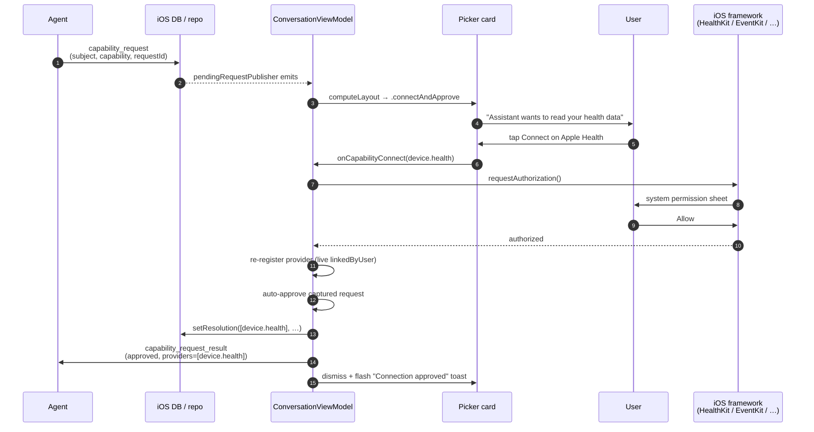
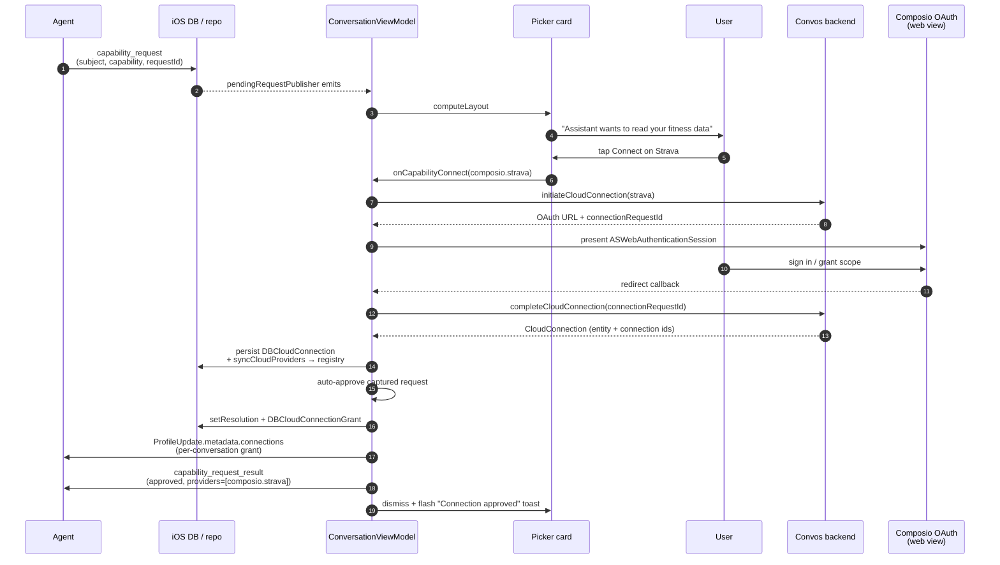
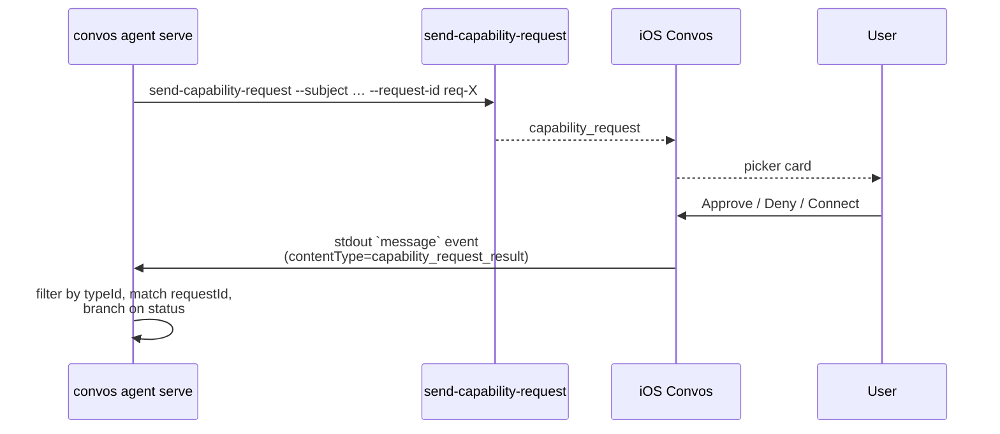

# Capability Resolution: End-to-End User Flows

Companion to `docs/plans/capability-resolution.md`. That doc explains the
*model* (subjects, providers, resolutions, federation). This doc shows what
actually happens, tap by tap, when an agent asks for something — for the
device path (Apple Health, Apple Calendar, …) and the cloud path (Composio:
Strava, Google Calendar, …).

Both paths share an opening (agent posts a `capability_request`, the picker
card surfaces) and a closing (we post a `capability_request_result` reply).
The middle differs in *where* the linking work happens and *who owns* the
"is this provider linked?" answer.

## Device flow



Key idea: the Connect tap *is* the user's approval — there's no second
"Approve" button on the `.connectAndApprove` variant. The approve fires
against the **captured** request (so a newer request arriving during the OS
prompt can't get auto-approved on the original's behalf), and the result is
posted whether or not the local resolver write succeeds.

## Cloud flow



The cloud side has two extra hops the device side doesn't:

- **Backend round-trip** for OAuth initiation + completion, since Composio
  tokens live server-side.
- **Per-conversation grant** (`DBCloudConnectionGrant` + a `ProfileUpdate`
  metadata write) so the agent's runtime knows *this conversation* is
  authorized to invoke the connection. The device side has no analog —
  iOS-framework permissions are device-wide, not per-conversation.

The user can also link a cloud connection pre-emptively in app settings
(`Convos/App Settings/ConnectionsListView.swift`) before any agent asks; the
flow is the same minus the `capability_request` opener.

## Wire payload, request


Request:

```json
{
  "version": 1,
  "requestId": "req-…",
  "subject": "fitness",
  "capability": "read",
  "rationale": "To summarize your training week",
  "preferredProviders": ["composio.strava"]
}
```

Result (approve / federating subject / multi-provider):

```json
{
  "version": 1,
  "requestId": "req-…",
  "status": "approved",
  "subject": "fitness",
  "capability": "read",
  "providers": ["composio.strava", "device.health"]
}
```

Result (deny / cancel — same shape, different status, empty providers):

```json
{
  "version": 1,
  "requestId": "req-…",
  "status": "denied",
  "subject": "fitness",
  "capability": "read",
  "providers": []
}
```

Provider IDs: `device.<ConnectionKind.rawValue>` for iOS-framework providers,
`composio.<canonical_service_name>` for cloud providers. `providers` is sorted
ascending so the wire payload is deterministic.

## Convos-cli agent loop



The `message` event the agent sees on stdout:

```json
{
  "event": "message",
  "id": "ae41…",
  "senderInboxId": "8b70…",
  "contentType": {
    "authorityId": "convos.org",
    "typeId": "capability_request_result",
    "versionMajor": 1,
    "versionMinor": 0
  },
  "content": "{\"version\":1,\"requestId\":\"req-X\",\"status\":\"approved\", … }",
  "sentAt": "2026-04-28T15:24:43.938Z"
}
```

Minimal bash skeleton:

```bash
convos agent serve --name "Coach" | while IFS= read -r event; do
  type=$(echo "$event" | jq -r '.event')
  case "$type" in
    ready)
      conv=$(echo "$event" | jq -r '.conversationId')
      convos conversation send-capability-request "$conv" \
        --subject fitness --capability read \
        --rationale "I'd like to summarize your week." \
        --request-id req-week-summary
      ;;
    message)
      tid=$(echo "$event" | jq -r '.contentType.typeId')
      [ "$tid" = "capability_request_result" ] || continue
      result=$(echo "$event" | jq -r '.content')
      [ "$(echo "$result" | jq -r '.requestId')" = "req-week-summary" ] || continue
      status=$(echo "$result" | jq -r '.status')
      providers=$(echo "$result" | jq -r '.providers | join(",")')
      if [ "$status" = "approved" ]; then
        # invoke the matching tool against $providers
        printf '%s\n' '{"type":"send","text":"On it — pulling your week now."}'
      else
        printf '%s\n' '{"type":"send","text":"No worries, skipping that."}'
      fi
      ;;
  esac
done
```

There's no polling — the agent just keeps reading from `convos agent serve`'s
stdout. Reconnects auto-catchup, so a transient disconnect during the OS
prompt won't drop the result.

## State ownership at a glance

| Concern | Source of truth |
|---------|-----------------|
| Which providers exist for which subject (this session) | `CapabilityProviderRegistry` (in-memory) |
| Whether a device permission is granted | iOS framework, queried live by `DeviceCapabilityProvider.linkedByUser` |
| Whether a cloud OAuth grant exists | `DBCloudConnection` (mirrored from Composio via backend) |
| Which provider the user picked for `(subject, conversation, capability)` | `DBCapabilityResolution` |
| Per-conversation cloud grant | `DBCloudConnectionGrant` + published `ProfileUpdate.metadata.connections` |
| Which `capability_request` is still unanswered | computed on the fly by `CapabilityRequestRepository` (no separate table) |
