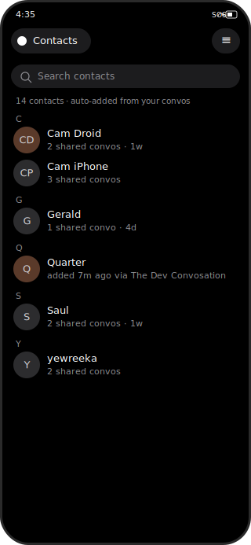
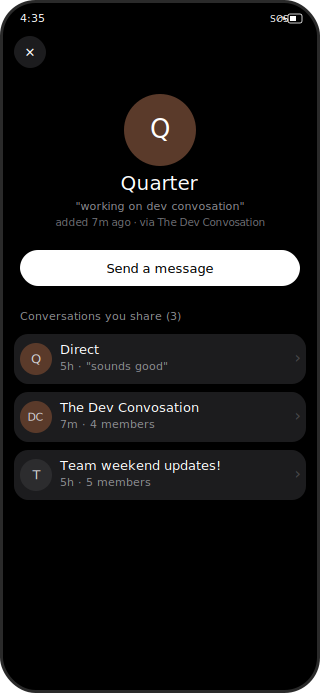
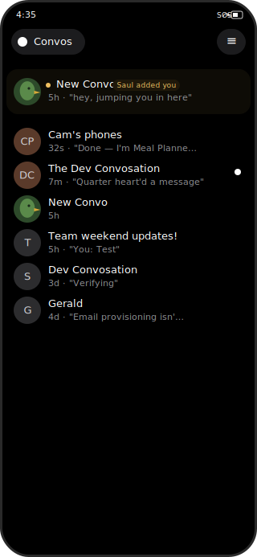
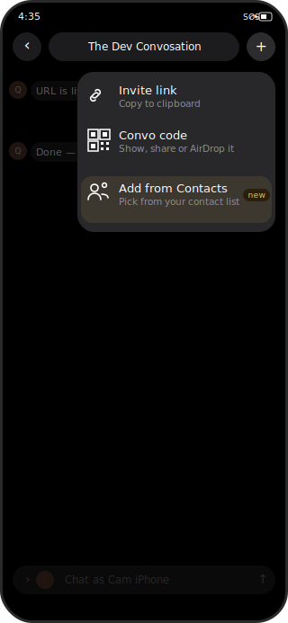
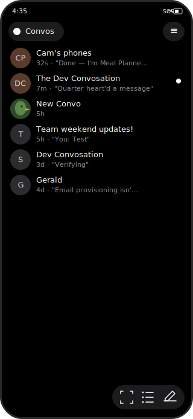
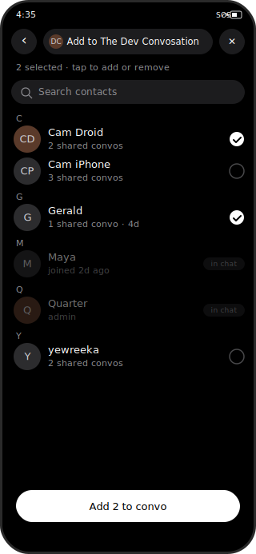

# 1-Pager: Contact List (Contacts MVP)

> **Status**: Draft
> **Author**: Cameron Voell
> **Created**: 2026-04-27
> **Updated**: 2026-04-28 (six wireframes added)

## 1. Tweet Headline

👉 "Convos now has a contact list — everyone you've ever talked to, in one place, ready to start a new chat."

## 2. Show, Don't Tell

Wireframes for the six MVP surfaces. Built as standalone SVGs so they live in-repo and render in any markdown viewer.

| | |
|:---:|:---:|
|  **1. Contacts list** — alphabetical, search, "via" subtitle hints at auto-add. Browse-mode entry point: tap a row to open the contact card |  **2. Contact card** — profile + every shared conversation. Single-recipient flow: card → "Send a message" → 1:1 chat |
|  **3. Inbound chats in main feed** — subtle "added you" badge, no separate tray |  **4. "Add from Contacts"** — new row in the chat plus-menu, alongside Invite link and Convo code |
|  **5. Contacts icon in conversations toolbar** — third icon between scan and compose, opens screen 1. Open question whether 3 icons is too many |  **6. Contacts picker** — invoked from screen 4. Same row component as screen 1 in pick-mode. Members already in the destination chat sit inline alphabetically, dimmed, with an "in chat" badge so the user can see why they're not selectable |

These are wireframes, not final visuals — they fix the surfaces and copy but leave room for a real designer pass before ship. Two design notes worth calling out from the sketching pass:

- **Browse vs. picker is one component, two modes.** Screens 1 and 6 share a row format, search bar, and alphabetical sectioning by design — the picker should read as "your contacts, with toggles" rather than as a different surface. The differences are: tap behavior (open card vs. toggle check), header (just a title vs. a destination chat pill), and bottom CTA. The browse mode (1) is the only path to the contact card; the picker (6) is invoked solely from the chat plus-menu row in screen 4.
- **No standalone "new conversation" picker.** Compose creates an empty convo with an auto-generated name; participants are added afterward via the chat plus-menu, which routes through the picker (6). Single-recipient DMs flow through the contact card's "Send a message" CTA on screen 2. This keeps the picker tightly scoped to one job ("add people to this chat from your contacts") and removes a redundant entry point.

Open visual questions still on the table: sort/search behavior on screen 1 (alphabetical vs. recency toggle), empty state for a contact with zero remaining shared conversations on screen 2, whether the "added you" badge on screen 3 wants accept/ignore inline actions or relies on opening the convo to engage, whether 3 icons in the conversations toolbar (screen 5) feels crowded vs. moving the contacts entry point elsewhere, and whether the picker should section off "already in this chat" members at large group sizes (the inline-disabled treatment is fine for groups up to ~10; beyond that we may want to revisit).

- 🍿 Loom demo link — N/A
- 🎨 Figma file link — N/A

## 3. How It Works

The five MVP features:

1. **Contact list** — a local "address book" of every user you've had a conversation with. Backed by a new GRDB table; a contact is keyed by `inboxId` (the other party's inbox identifier under the single-inbox identity model from ADR-011).
2. **Contact card** — a per-contact detail screen that surfaces the user's profile (name, avatar, bio via the existing member-profile system in ADR-005) and the list of conversations you currently share with them. Send Message starts a new group with just you and that member if you do not have one already. If you have one already, I'm thinking we send you to the existing 1 on 1 Group, maybe with a temporary bubble that says (start a new chat instead?).
3. **Auto-add on conversation join or new member add** — when the local user joins a conversation (1:1, group, or invite-accept flow), every other participant is added as a contact if not already present. If a new user joins a conversation, they are auto-added as a new contact as well. This is MVP behavior, still thinking how we can add more user choice here. 
4. **Add a known contact to an existing chat + inbound chats surfacing** — inside an existing conversation, surface a "+ Add contact" affordance backed by the contact list. Inbound conversations the local user has been added to (by others) appear in the main conversations feed for MVP — no separate requests tray.
5. **Start a new conversation with a contact** — For MVP, the two places you can do this are from the send message button on a contact screen, or from the plus button on a new conversation. 

Auto-add scope:

- **Past conversations on first migration**: a one-time backfill scans every existing conversation on the device and populates the contacts table. 
- **New conversations going forward**: auto-add fires on the conversation-join hook (same plumbing the migration uses, just called per-event).
- **New Member added to a group**: on group refresh we should passively calculate the group membership state and check to see if it has updated since we last synced contacts. 

## 4. Who Cares

- **New user onboarding from invite link**: Maya joins a Convos group via invite, gets auto-added as a contact for everyone in that group, and now has a starter set of people she can DM directly without re-discovering them.
- **Power user with many overlapping groups**: Jarod is in 30 group chats with overlapping memberships. He wants to DM someone he met in one of them but can't remember which group — the contact list collapses everyone into a single searchable surface.
- **Cross-conversation context**: Cameron taps a contact card and immediately sees every conversation he shares with that person — useful for "where did I last talk to this person about X?" without having to scroll the whole inbox.
- **Reaching out from outside an existing chat**: Alice wants to message Bob but they don't have a 1:1 yet — only a shared group. "Start new conversation with contact" turns Bob into a directly-addressable person, not just a group member.

## 5. What It Isn't

- **This is not a discovery / global directory.** You can only contact someone you've already shared a conversation with.
- **This does not solve cross-device sync.** Contacts live in local GRDB only for MVP. A future integration with a backups system (for users who lose a device) is anticipated but explicitly out of scope.
- **This is not a server-side contact graph.** No backend storage, no server-side queries, no "people you may know" recommendations.
- **This is not a permissions / blocking system.** Blocked users — see UAQ — are not implemented in Convos today, and the contact list is not the right place to add them. We will add a hook to filter blocked users *if and when* a blocking concept is introduced.
- **This is not a separate "message requests" inbox.** Inbound chats appear inline in the main conversations feed for MVP.
- **This is not multi-inbox aware.** Contacts assume the single-inbox identity model from ADR-011.

## 6. FAQ + UAQ

### FAQ (known questions)

1. **Q**: How is a contact identified?
   **A**: By the other party's `inboxId` under the single-inbox identity model ([ADR-011](../adr/011-single-inbox-identity-model.md)). The contact row stores the `inboxId`; profile data (display name, avatar, bio) is resolved through the existing member-profile system ([ADR-005](../adr/005-member-profile-system.md)), not duplicated in the contacts table.

2. **Q**: What happens when I'm in a 1,000-person group chat?
   **A**: For MVP, every participant is auto-added. We've flagged "make auto-add configurable for large stranger groups" as an explicit follow-up TODO so we can ship MVP without being blocked on the policy debate.

3. **Q**: Why local-only? Won't users be sad if they switch phones and lose contacts?
   **A**: Yes, eventually. Per the answer in the brief, MVP scope is local GRDB only, and integration with a future backups system is anticipated. We'd rather ship contacts now and layer on durable storage when the backup system is ready, than block on it.

4. **Q**: How do we avoid re-scanning conversations every launch?
   **A**: A `contacts_synced_at` (or equivalent) marker per conversation, stored in GRDB. Scan once, mark synced, skip on subsequent launches.

5. **Q**: Where does the inbound-chats UI live?
   **A**: In the main conversations feed for MVP. We are *not* building a separate requests/pending tray (cf. `docs/plans/show-pending-invites-home-view.md` which is a related but distinct surface).

### UAQ (unanswered questions)

- [ ] **Blocked users** — Convos does not currently implement a user-blocking concept (verified: no `BlockedUser`, `isBlocked`, or `BlockList` types in the codebase). What should happen in MVP? Two reasonable defaults: (a) ship without any block awareness and add the filter later when blocking lands, or (b) add an `isBlocked: Bool` column to contacts now as future-proofing. Recommend (a) for simplicity unless we know blocking is coming soon.
- [ ] **Removing a contact** — can the user manually delete a contact from the list? If so, do they re-appear on next conversation activity, or is there a "hidden" / "soft-delete" state?
- [ ] **Self-contact** — does the local user appear as a contact (e.g. for a "note to self" flow)? Default answer: no.
- [ ] **Contact card → conversation list** — what's shown when a contact has *no* conversations remaining (e.g. you left every group you shared)? Empty state with a "Start a conversation" CTA?
- [ ] **Sort + search** — alphabetical with search, or recency-based? Likely both with a toggle, but needs a designer call.
- [ ] **Naming for the auto-add semantics** — is this called "Contacts," "Address Book," or something more Convos-flavored? Settle this before strings ship.
- [ ] **Migration performance** — for users with many large groups, the first-launch backfill could be expensive. Background task, batched, or streamed during normal app use?
- [ ] **Privacy framing** — does auto-adding everyone in every group chat create a privacy expectation issue (the other party doesn't know they've been "added")? Since this is purely local, probably fine, but worth a quick legal/privacy check.

## 7. Counterintuitive Angle

👉 "Convos already has a contact list — it's just smeared across every conversation. Naming it unlocks the social features (DMs from groups, profile-first navigation, future backups, future blocking) that everyone is going to want next."

## 8. Call to Action

- [x] ✅ Build
- [ ] 🧪 Test
- [ ] 🚫 Drop
- [ ] 💬 Debate

**Next steps if approved:**

- Hand the wireframes in [`contact-list-mocks/`](./contact-list-mocks/) to a designer for a polish pass and a Figma source — the SVGs fix the five surfaces and the copy, but the visual treatment (typography, spacing, the "added you" badge styling, toolbar icon) deserves a designer's eye before ship.
- Resolve the open UAQs above, especially the blocked-users default and contact-removal semantics.
- Graduate this 1-pager to a full PRD at `docs/plans/contact-list.md` (in place) using `docs/TEMPLATE_PRD.md`.
- Bring in the `swift-architect` agent to design the GRDB schema, the auto-add hook integration with the conversation-join flow, and the migration strategy.
- Likely needs a new ADR for the storage model and its forward-compatibility with the future backups system.

## References

- [ADR-005: Member Profile System](../adr/005-member-profile-system.md) — profile resolution we'll lean on for contact display.
- [ADR-011: Single Inbox Identity Model](../adr/011-single-inbox-identity-model.md) — the identity assumption that lets us key contacts on `inboxId`.
- [docs/plans/show-pending-invites-home-view.md](./show-pending-invites-home-view.md) — related but distinct surface for pending invites; we are *not* building that for inbound chats in MVP.
