# Convos iOS — ViewModel → Dependency Map

> Generated by `Scripts/generate_vm_map_ios.py` — do not edit by hand; CI
> regenerates and fails on drift. Interactive version: `docs/vm-map.html`.
> Scope: iOS counterpart of android architecture.md §15 — one chart, no more.

**Question this answers:** what does each ViewModel depend on, and which
ones carry too many collaborators? **Action it drives:** read before
touching a surface; split outliers.

ViewModels: **15** · dependency edges: **88** · max collaborators: **39**

```mermaid
graph LR
  subgraph Repositories["Repositories"]
    AgentBuilderSummaryRepository["AgentBuilderSummaryRepository"]
    AgentFilesLinksRepository["AgentFilesLinksRepository"]
    AgentTemplateRepository["AgentTemplateRepository"]
    BuilderBundleHiddenMessagesRepository["BuilderBundleHiddenMessagesRepository"]
    CapabilityRequestRepository["CapabilityRequestRepository"]
    CloudConnectionRepository["CloudConnectionRepository"]
    ContactsRepository["ContactsRepository"]
    ConversationRepository["ConversationRepository"]
    ConversationsCountRepository["ConversationsCountRepository"]
    ConversationsRepository["ConversationsRepository"]
    MessagesListRepository["MessagesListRepository"]
    MessagesRepository["MessagesRepository"]
    MyGlobalProfileRepository["MyGlobalProfileRepository"]
    MyProfileRepository["MyProfileRepository"]
    PhotoPreferencesRepository["PhotoPreferencesRepository"]
    ProfilesRepository["ProfilesRepository"]
    ThinkingSessionRepository["ThinkingSessionRepository"]
    VoiceMemoTranscriptRepository["VoiceMemoTranscriptRepository"]
  end
  subgraph Services["Services"]
    MessagingService["MessagingService"]
    PairingService["PairingService"]
    SubscriptionService["SubscriptionService"]
    SuggestedAgentsService["SuggestedAgentsService"]
    VoiceMemoTranscriptionService["VoiceMemoTranscriptionService"]
  end
  subgraph Managers["Managers"]
    BackgroundUploadManager["BackgroundUploadManager"]
    CloudConnectionManager["CloudConnectionManager"]
    ConversationStateManager["ConversationStateManager"]
    SessionManager["SessionManager"]
    TypingIndicatorManager["TypingIndicatorManager"]
  end
  subgraph Stores___caches["Stores & caches"]
    ConnectionEnablementStore["ConnectionEnablementStore"]
    ConnectionServicesStore["ConnectionServicesStore"]
  end
  subgraph Coordinators["Coordinators"]
    ConversationOnboardingCoordinator["ConversationOnboardingCoordinator"]
    FocusCoordinator["FocusCoordinator"]
    PairingCoordinator["PairingCoordinator"]
  end
  subgraph Writers["Writers"]
    AttachmentLocalStateWriter["AttachmentLocalStateWriter"]
    CapabilityRequestResultWriter["CapabilityRequestResultWriter"]
    ConnectionEventWriter["ConnectionEventWriter"]
    ConnectionGrantWriter["ConnectionGrantWriter"]
    ConversationConsentWriter["ConversationConsentWriter"]
    ConversationExplosionWriter["ConversationExplosionWriter"]
    ConversationLeaveWriter["ConversationLeaveWriter"]
    ConversationLocalStateWriter["ConversationLocalStateWriter"]
    ConversationMetadataWriter["ConversationMetadataWriter"]
    MessageWriter["MessageWriter"]
    MyGlobalProfileWriter["MyGlobalProfileWriter"]
    OutgoingMessageWriter["OutgoingMessageWriter"]
    PhotoPreferencesWriter["PhotoPreferencesWriter"]
    ReactionWriter["ReactionWriter"]
    ReadReceiptWriter["ReadReceiptWriter"]
  end
  subgraph Child_VMs___other["Child VMs & other"]
    AgentBuilderViewModel["AgentBuilderViewModel"]
    AppSettingsViewModel["AppSettingsViewModel"]
    ConnectionsListViewModel["ConnectionsListViewModel"]
    ConversationViewModel["ConversationViewModel"]
    JoinerPairingSheetViewModel["JoinerPairingSheetViewModel"]
    MyProfileViewModel["MyProfileViewModel"]
    NewConversationViewModel["NewConversationViewModel"]
    PairingSheetViewModel["PairingSheetViewModel"]
    QRScannerViewModel["QRScannerViewModel"]
  end
  subgraph VMs["ViewModels"]
    AgentBuilderViewModel["AgentBuilderViewModel"]
    AppSettingsViewModel["AppSettingsViewModel"]
    ConnectionsListViewModel["ConnectionsListViewModel"]
    ContactsPickerViewModel["ContactsPickerViewModel"]
    ContactsViewModel["ContactsViewModel"]
    ConversationViewModel["ConversationViewModel"]
    ConversationsViewModel["ConversationsViewModel"]
    DevicesViewModel["DevicesViewModel"]
    JoinerPairingSheetViewModel["JoinerPairingSheetViewModel"]
    MyProfileViewModel["MyProfileViewModel"]
    NewConversationViewModel["NewConversationViewModel"]
    PairingSheetViewModel["PairingSheetViewModel"]
    PaywallViewModel["PaywallViewModel"]
    ProfileSettingsViewModel["ProfileSettingsViewModel"]
    ThingsOverviewViewModel["ThingsOverviewViewModel"]
  end
  AgentBuilderViewModel --> CloudConnectionManager
  AgentBuilderViewModel --> CloudConnectionRepository
  AgentBuilderViewModel --> MessagingService
  AgentBuilderViewModel --> NewConversationViewModel
  AgentBuilderViewModel --> SessionManager
  AppSettingsViewModel --> CloudConnectionManager
  AppSettingsViewModel --> CloudConnectionRepository
  AppSettingsViewModel --> ConnectionsListViewModel
  AppSettingsViewModel --> SessionManager
  ConnectionsListViewModel --> CloudConnectionManager
  ConnectionsListViewModel --> CloudConnectionRepository
  ContactsPickerViewModel --> ContactsRepository
  ContactsPickerViewModel --> SuggestedAgentsService
  ContactsViewModel --> ContactsRepository
  ContactsViewModel --> SuggestedAgentsService
  ConversationViewModel --> AgentBuilderSummaryRepository
  ConversationViewModel --> AgentBuilderViewModel
  ConversationViewModel --> AgentTemplateRepository
  ConversationViewModel --> AttachmentLocalStateWriter
  ConversationViewModel --> BackgroundUploadManager
  ConversationViewModel --> BuilderBundleHiddenMessagesRepository
  ConversationViewModel --> CapabilityRequestRepository
  ConversationViewModel --> CapabilityRequestResultWriter
  ConversationViewModel --> CloudConnectionManager
  ConversationViewModel --> CloudConnectionRepository
  ConversationViewModel --> ConnectionEnablementStore
  ConversationViewModel --> ConnectionEventWriter
  ConversationViewModel --> ConnectionGrantWriter
  ConversationViewModel --> ConnectionServicesStore
  ConversationViewModel --> ContactsRepository
  ConversationViewModel --> ConversationConsentWriter
  ConversationViewModel --> ConversationExplosionWriter
  ConversationViewModel --> ConversationLeaveWriter
  ConversationViewModel --> ConversationLocalStateWriter
  ConversationViewModel --> ConversationMetadataWriter
  ConversationViewModel --> ConversationOnboardingCoordinator
  ConversationViewModel --> ConversationRepository
  ConversationViewModel --> ConversationStateManager
  ConversationViewModel --> MessageWriter
  ConversationViewModel --> MessagesListRepository
  ConversationViewModel --> MessagesRepository
  ConversationViewModel --> MessagingService
  ConversationViewModel --> MyProfileViewModel
  ConversationViewModel --> NewConversationViewModel
  ConversationViewModel --> OutgoingMessageWriter
  ConversationViewModel --> PhotoPreferencesRepository
  ConversationViewModel --> PhotoPreferencesWriter
  ConversationViewModel --> ReactionWriter
  ConversationViewModel --> ReadReceiptWriter
  ConversationViewModel --> SessionManager
  ConversationViewModel --> ThinkingSessionRepository
  ConversationViewModel --> TypingIndicatorManager
  ConversationViewModel --> VoiceMemoTranscriptRepository
  ConversationViewModel --> VoiceMemoTranscriptionService
  ConversationsViewModel --> AgentBuilderViewModel
  ConversationsViewModel --> AppSettingsViewModel
  ConversationsViewModel --> ConversationExplosionWriter
  ConversationsViewModel --> ConversationLocalStateWriter
  ConversationsViewModel --> ConversationViewModel
  ConversationsViewModel --> ConversationsCountRepository
  ConversationsViewModel --> ConversationsRepository
  ConversationsViewModel --> FocusCoordinator
  ConversationsViewModel --> JoinerPairingSheetViewModel
  ConversationsViewModel --> MessagingService
  ConversationsViewModel --> NewConversationViewModel
  ConversationsViewModel --> PairingSheetViewModel
  ConversationsViewModel --> SessionManager
  DevicesViewModel --> MessagingService
  DevicesViewModel --> PairingSheetViewModel
  DevicesViewModel --> SessionManager
  JoinerPairingSheetViewModel --> PairingService
  MyProfileViewModel --> MessagingService
  MyProfileViewModel --> MyProfileRepository
  MyProfileViewModel --> ProfilesRepository
  NewConversationViewModel --> ConversationStateManager
  NewConversationViewModel --> ConversationViewModel
  NewConversationViewModel --> MessagingService
  NewConversationViewModel --> QRScannerViewModel
  NewConversationViewModel --> SessionManager
  PairingSheetViewModel --> PairingCoordinator
  PairingSheetViewModel --> PairingService
  PaywallViewModel --> SubscriptionService
  ProfileSettingsViewModel --> MyGlobalProfileRepository
  ProfileSettingsViewModel --> MyGlobalProfileWriter
  ProfileSettingsViewModel --> SessionManager
  ThingsOverviewViewModel --> AgentFilesLinksRepository
  ThingsOverviewViewModel --> ConversationsRepository
  ThingsOverviewViewModel --> SessionManager
```

## Inventory

| ViewModel | Deps | Depends on |
|---|---|---|
| ConversationViewModel | 39 | AgentBuilderSummaryRepository, AgentBuilderViewModel, AgentTemplateRepository, AttachmentLocalStateWriter, BackgroundUploadManager, BuilderBundleHiddenMessagesRepository, CapabilityRequestRepository, CapabilityRequestResultWriter, CloudConnectionManager, CloudConnectionRepository, ConnectionEnablementStore, ConnectionEventWriter, ConnectionGrantWriter, ConnectionServicesStore, ContactsRepository, ConversationConsentWriter, ConversationExplosionWriter, ConversationLeaveWriter, ConversationLocalStateWriter, ConversationMetadataWriter, ConversationOnboardingCoordinator, ConversationRepository, ConversationStateManager, MessageWriter, MessagesListRepository, MessagesRepository, MessagingService, MyProfileViewModel, NewConversationViewModel, OutgoingMessageWriter, PhotoPreferencesRepository, PhotoPreferencesWriter, ReactionWriter, ReadReceiptWriter, SessionManager, ThinkingSessionRepository, TypingIndicatorManager, VoiceMemoTranscriptRepository, VoiceMemoTranscriptionService |
| ConversationsViewModel | 13 | AgentBuilderViewModel, AppSettingsViewModel, ConversationExplosionWriter, ConversationLocalStateWriter, ConversationViewModel, ConversationsCountRepository, ConversationsRepository, FocusCoordinator, JoinerPairingSheetViewModel, MessagingService, NewConversationViewModel, PairingSheetViewModel, SessionManager |
| AgentBuilderViewModel | 5 | CloudConnectionManager, CloudConnectionRepository, MessagingService, NewConversationViewModel, SessionManager |
| NewConversationViewModel | 5 | ConversationStateManager, ConversationViewModel, MessagingService, QRScannerViewModel, SessionManager |
| AppSettingsViewModel | 4 | CloudConnectionManager, CloudConnectionRepository, ConnectionsListViewModel, SessionManager |
| DevicesViewModel | 3 | MessagingService, PairingSheetViewModel, SessionManager |
| MyProfileViewModel | 3 | MessagingService, MyProfileRepository, ProfilesRepository |
| ProfileSettingsViewModel | 3 | MyGlobalProfileRepository, MyGlobalProfileWriter, SessionManager |
| ThingsOverviewViewModel | 3 | AgentFilesLinksRepository, ConversationsRepository, SessionManager |
| ConnectionsListViewModel | 2 | CloudConnectionManager, CloudConnectionRepository |
| ContactsPickerViewModel | 2 | ContactsRepository, SuggestedAgentsService |
| ContactsViewModel | 2 | ContactsRepository, SuggestedAgentsService |
| PairingSheetViewModel | 2 | PairingCoordinator, PairingService |
| JoinerPairingSheetViewModel | 1 | PairingService |
| PaywallViewModel | 1 | SubscriptionService |
