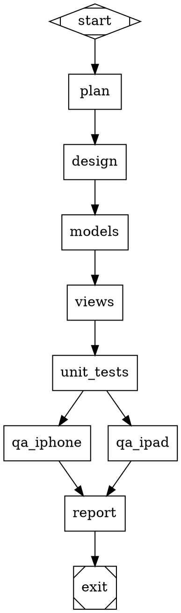

# Autonomous Coding Agent — Game Plan

A phased plan to move from human-driven development to an autonomous coding agent that writes, validates, and ships code with minimal human oversight.

## Vision

A dedicated Mac Mini runs a coding agent 24/7. It picks up tasks from Linear, writes the code, validates its own work via QA, opens PRs, responds to review comments, and cleans up after merge. Humans transition from writing code to reviewing it, and eventually from reviewing to auditing.

Based on the [Software Factory](https://factory.strongdm.ai) model from StrongDM.

## Current State

What exists today:
- **QA test suite** — 15 tests covering onboarding, messaging, invites, reactions, replies, profiles, pinning, muting, locking, exploding, migration, quicknames, and performance
- **QA rules** (`qa/RULES.md`) — error classification, log monitoring, ephemeral UI handling, self-improvement practices
- **QA skills** — `qa` (runner), `qa-writer` (authoring new tests), `convos-cli` (CLI reference), `run` (build + launch)
- **Claude Code + Pi** — agent harness with MCP tools, simulator control, subagents
- **Graphite** — PR stacking and management
- **convos-task** — worktree isolation and parallel task management

What's missing:
- Autonomous task pickup (Linear → agent)
- Self-validation gates before PR
- PR review response loop
- Post-merge cleanup
- Confidence that QA catches enough to trust the agent

---

## Phase 1: Harden QA (Weeks 1-2)

The QA suite is the foundation of agent trust. If the agent can't reliably validate its own work, nothing downstream works.

### Goals
- Expand from 15 tests to 30+
- Every test passes 10 consecutive runs without flaking
- Full suite runs end-to-end and produces a single pass/fail

### Tasks

**Expand coverage:**
- Add tests for every user-facing feature not currently covered
- Add negative tests: invalid invite URLs, network interruption simulation, corrupt data handling
- Add edge cases: empty conversation names, very long messages, rapid message sending
- Add multi-device tests: same conversation open on iPhone + iPad simultaneously

**Visual regression:**
- Screenshot comparison between runs (not just "element exists" but "layout matches baseline")
- Capture baseline screenshots for each test step
- Detect layout shifts, missing elements, rendering glitches

**Fix known issues:**
- Attachment testing needs real image files (ImageMagick/Pillow dependency or bundled test assets)
- Ephemeral UI detection still occasionally misses quickname pill
- `UNIQUE constraint: conversation.inviteTag` error needs investigation

**Reliability:**
- Run full suite 3x in a row, fix every flake
- Add retry logic to tests that depend on network timing
- Document expected XMTP errors per test so future runs don't false-alarm

### Definition of Done
- 30+ tests, all green, 3 consecutive full-suite runs without failure
- Test assets (images, files) bundled in `qa/fixtures/`
- Full suite takes < 30 minutes

---

## Phase 2: Task Runner Daemon (Weeks 2-4)

A simple daemon on the Mac Mini that polls for work and orchestrates the agent.

### Architecture

```
┌─────────────┐     ┌──────────────────┐     ┌─────────────┐
│   Linear     │────▶│   Task Runner    │────▶│  GitHub PR   │
│  (assigned)  │     │  (Mac Mini)      │     │  (opened)    │
└─────────────┘     └──────────────────┘     └─────────────┘
                           │
                    ┌──────┴──────┐
                    │             │
               Code Agent    QA Agent
               (worktree)   (simulator)
```

### The Loop

1. Poll Linear for issues assigned to the agent account with label `agent-ready`
2. For each task:
   - Create a worktree (`convos-task new <task-name>`)
   - Boot a dedicated simulator
   - Read the Linear issue description for requirements
   - If there's a linked PRD in `docs/plans/`, read that too
   - Run Claude Code headless with the task as the prompt
   - Build → lint → run relevant QA tests
   - If QA passes: open PR via Graphite, link to Linear issue, move to "In Review"
3. Watch for PR review comments
   - When new comments arrive, run Claude Code to address them
   - Re-run validation gates
   - Push updates
4. When approved + merged:
   - Clean up worktree (`convos-task cleanup`)
   - Delete simulator
   - Move Linear issue to "Done"

### Implementation

Start as a shell script — the sophistication is in Claude Code and the QA suite, not the orchestration. Can evolve to a proper service later.

Key decisions:
- **One task at a time** to start (avoid resource contention on simulators)
- **Timeout per task** — if the agent can't complete in 2 hours, flag for human help
- **Failure handling** — if QA fails 3 times, move issue to "Needs Human" in Linear
- **Logging** — every agent session logged for post-mortem analysis

### Mac Mini Setup

- Dedicated GitHub account (e.g., `convos-agent`)
- Dedicated Claude Code account with API access
- Linear account with agent-specific labels and workflow states
- Multiple iOS simulators pre-created (iPhone + iPad)
- Repository cloned with all dependencies installed
- `convos` CLI initialized for dev environment
- SSH access for human operators to debug

---

## Phase 3: Self-Validation Gates (Weeks 4-6)

Before opening a PR, the agent must pass a gauntlet. Each gate produces an artifact attached to the PR.

### Gates

1. **Build gate** — compiles with zero warnings (not just zero errors)
2. **Lint gate** — SwiftLint + SwiftFormat clean, no new violations
3. **Unit test gate** — all existing tests pass + new tests added for new code
4. **QA gate** — relevant QA tests pass on both iPhone and iPad
5. **Regression gate** — full QA suite passes (nothing broke that was working before)
6. **Self-review gate** — agent reviews its own diff with the `code-reviewer` subagent and fixes issues before submitting

### Gate Artifacts

Each gate produces a report that gets included in the PR description:

```markdown
## Validation Report

| Gate | Status | Duration | Details |
|------|--------|----------|---------|
| Build | ✅ | 45s | 0 warnings, 0 errors |
| Lint | ✅ | 3s | 0 violations |
| Unit Tests | ✅ | 120s | 47/47 passed, 3 new tests added |
| QA (iPhone) | ✅ | 8m | 30/30 criteria passed |
| QA (iPad) | ✅ | 8m | 30/30 criteria passed |
| Regression | ✅ | 25m | Full suite green |
| Self-Review | ✅ | — | 2 issues found and fixed |
```

### Tracking Trust

Maintain a log of:
- How often human reviewers catch things the gates missed
- What category each catch falls into (logic bug, UI issue, performance, style)
- Whether a new gate/test could have caught it

This log drives continuous improvement of the gates.

---

## Phase 4: Add Attractor Pipeline Engine (Weeks 6-8)

Once the outer loop works and gates are reliable, add Attractor for complex multi-step features.

### Why Attractor

- **Checkpointing** — if QA fails, don't re-run the entire pipeline, just fix and resume
- **Parallel branches** — run iPhone and iPad QA simultaneously
- **Conditional routing** — if unit tests fail, skip QA and go straight to fix
- **Human gates** — pause for design review before building views
- **Execution history** — CXDB tracks every run for debugging and analytics

### Example Pipeline



### Which Implementation

**Recommendation: Kilroy** (github.com/danshapiro/kilroy)
- Most complete implementation
- Go (fast, single binary)
- CXDB for execution history
- Supports Claude as a backend
- Git worktree isolation built-in
- Active development

Don't commit to this yet — evaluate when you're ready for Phase 4. The landscape may have changed by then.

### Where Pi Fits

Pi is the agent harness — it stays as the inner execution layer regardless of orchestration:

```
Outer loop:  Linear → Task Runner → PR → Review → Merge
Inner loop:  Pi + Claude Code + Skills + MCP Tools + Simulator
Pipeline:    Attractor (for complex multi-step tasks)
```

Pi doesn't compete with Attractor. Pi is what the agent *is*. Attractor is how you *orchestrate* multi-step agent work. The task runner is what *feeds* work to the agent.

---

## Phase 5: Reduce Human Review (Weeks 8+)

This is earned, not declared. The path:

1. **Full review** — humans review every PR (current state after Phase 3)
2. **Spot-check** — humans review 50% of PRs, selected randomly or by complexity
3. **Audit-only** — auto-merge when all gates pass, humans review post-merge by sampling
4. **Trust** — humans define what to build, agent builds and ships it

### How to Get There

Track a "gate miss rate" — how often human reviewers catch something the automated gates missed. When the miss rate drops below a threshold (e.g., < 5% of PRs have review findings), you can move to the next level.

For each finding a human reviewer catches:
1. Classify it (logic bug, UI issue, performance, style, security)
2. Determine if a gate could have caught it
3. If yes — add the check to the appropriate gate
4. If no — add a new gate or expand QA coverage

The miss rate should trend toward zero as the gates improve.

---

## This Week

1. **Don't pick an Attractor implementation yet.** Not needed for Phase 1-3.
2. **Harden the QA suite.** Add 5 more tests, make existing tests rock-solid, run the full suite 3x.
3. **Set up the Mac Mini.** Claude Code, pi, repo, simulators. Get it building and running QA via SSH.
4. **Write a simple task runner script.** `while true; sleep 60; check-linear; done` that creates worktrees and kicks off Claude Code.
5. **Try one end-to-end cycle manually.** Create a Linear issue → agent picks it up → writes code → runs QA → opens PR. Find the friction points.

The goal isn't to automate everything in week one. It's to close the loop once and find out what breaks.
